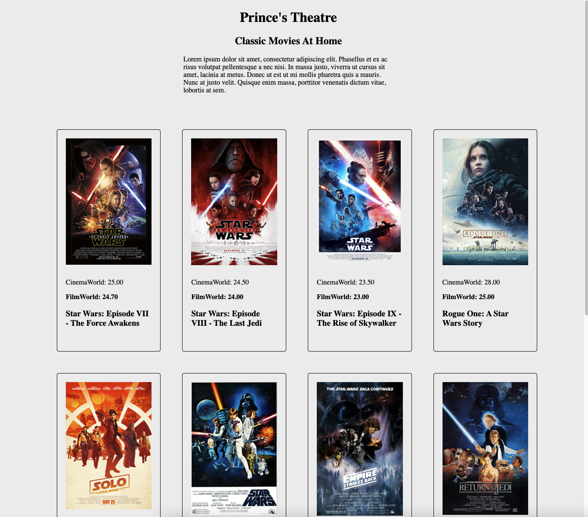

# Princes Theatre

## About the app
This is a simple price comparison web application to view a list of movies playing at 2 separate theatres. It highlights the cheapest price allowing for the client to make better financial movie-watching decisions.

## Technologies and Libraries used
This application is built on React with javascript. It uses Axios to make calls to the API.
  
## How to run
1. Clone the repository `$ git clone https://github.com/kevinosborn31/lexicon-test.git`
2. Navigate to the app:  `$ cd lexicon-test` 
3. Install required node packages and dependencies: `$ npm install`
4. Start the app: `$ npm start`
5. Application should run at: `http://localhost:3000/`

## Design and Architectural decisions
I have decided to use React to solve this problem as ease of re-use of components allows for strong scalability, if more movies or theatres were to be added, the app would have no issues consuming them.

Design wise, I have opted to use a mobile first design, using vanilla CSS. I considered using SASS but it seemed quite unnecessary for an app with only one page. Of course, using mobile first design and ensuring the UI is responsive.

I have compared the two cinema's prices by merging both objects of data into it's own "movieData" object stored in state, allowing for direct use of the "cinemaPrice' and "filmPrice" data elements.

The main challenge of implementing this user story was the unreliability of the API, which only worked just over half the time. My solution to this was to write a "retry" function, which will continue to re try to API call up to a max. This solution allows for a seamless reload, that the user doesn't even notice unless the console is open. If the endpoint is completely dead though and it fails after 50 tries, it will throw an error.

## Testing
Unit tests were a pain point for me, having limited experience in testing I struggled to find anywhere in the code where a unit test would be appropriate. The API calls are already catching the back end errors and validating the information coming through so it wouldn't be necessary there.

## Assumptions
I have assumed this will be a one-page application, consuming 2 different API endpoints for 2 cinemas. I also assumed the endpoint was unreliable, which needed the call to be re-run automatically.

## Future Development
Having only put this application together in 2 days, there are certain areas that can be improved to allow for a better user experience, and scalability. These are listed in order of priority

* Improved unit test coverage
* Fix small bugs in CSS, for movie tiles to be completely uniform
* Design a better solution for highlighting the best price, ideally to be within a function which can be tested
* Implement localhost cache storage for consumed movie data

## Take away
I certainly learnt more than I thought I would when creating this app, I don't often build applications from scratch, which was invaluable practice. It was also a challenge to deal with the unreliable endpoint as well as combining the 2 cinema objects with different ID's in order to compare the price.

I will be using the axios re-try function in future applications, even if the endpoint is reliable as it will catch any edge cases of data not being returned, and avoid ruining the user experience.

